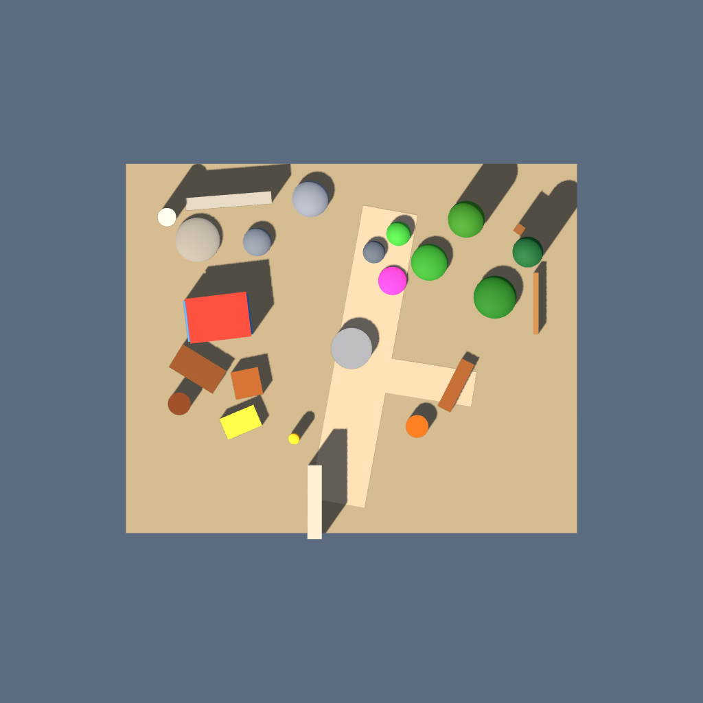
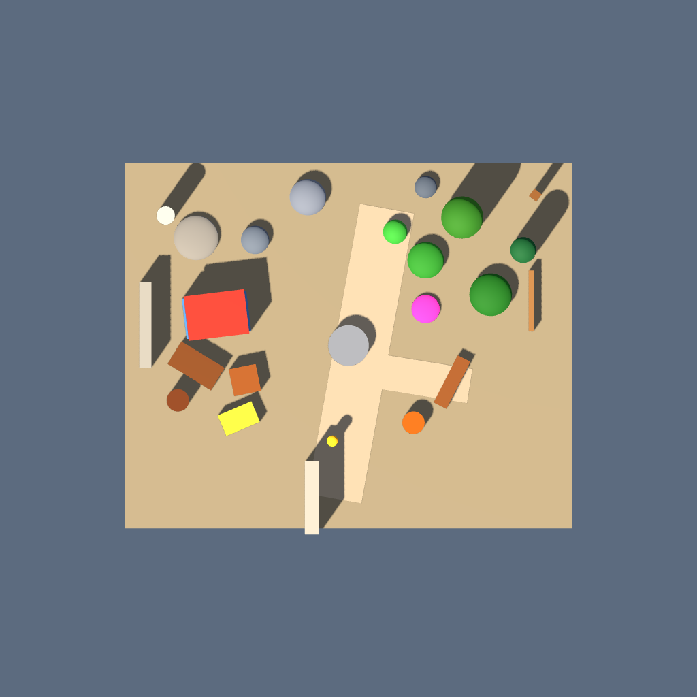

# Mapwright

Mapwright, Godot 4.x üzerinde Claude Code ile 3D level tasarlarken kullanılan bir **level-design skill'i ve altı deterministik validator'dan oluşan araç setidir**. Bir coding agent'ın yerine “AI level design” yaptığını iddia etmez; agent'ın kendi ürettiği spatial composition'ı tekrar, aralık, yoğunluk, landmark hiyerarşisi, erişilebilirlik ve görüş hattı gibi ölçülebilir kriterlerle değerlendirmesini, üç açıdan görsel olarak denetlemesini ve bulgulara göre yinelemeli biçimde iyileştirmesini sağlar.

> **v0.1 geliştirme sürümüdür.** Dar bir kapsamda çalışan ve test edilen bir pipeline sunar; sonuçları tasarım hükmü veya playtest yerine geçmez.

## v0.1 kapsamı

### Ne yapar?

- Godot 4.x `.tscn` sahnelerini statik olarak analiz eder.
- Claude Code'a zone planlama → sistematik yerleştirme → altı sayısal kontrol → üç açılı görsel kontrol → düzeltme döngüsü uygulatır.
- Aynı girdi ve eşiklerle tekrarlanabilir terminal raporları üretir.
- Asset silmeyi varsayılan çözüm yapmaz; önce yeniden konumlandırma, dağıtma, döndürme, ölçekleme veya uygun asset değişimini önerir.
- Godot 4.x ile `top_down`, `iso_ne` ve `iso_sw` PNG capture'ları üretir.

### Ne yapmaz?

- Godot 3.x, Unity veya Unreal desteği sunmaz.
- Claude Code dışındaki ChatGPT veya başka coding agent'lar için paketlenmiş bir skill değildir.
- Gameplay, encounter, combat, quest, pacing, AI davranışı veya ekonomi tasarlamaz; yalnız spatial composition kalitesine odaklanır.
- Godot fizik simülasyonu, gerçek NavigationMesh bake'i veya playtest çalıştırmaz.
- Estetik kaliteyi tek bir skorla “kanıtlamaz”. Validator uyarıları agent/insan incelemesine girdi sağlar.
- Her asset pipeline'ını kapsamaz. v0.1, repodaki tek örnek `.tscn` asset pack'iyle test edilmiştir; serialize edilmemiş imported-mesh ölçüleri çözümlenemeyebilir.

## Pipeline

`SKILL.md`, Claude Code'a şu sırayı uygulatır:

1. Level'ın amacı, giriş/çıkışları, rotaları, zone'ları, landmark niyeti ve negatif alanı planla.
2. Büyük ölçekli yapıdan küçük prop dressing'e doğru yerleştir.
3. Validator'ları `repetition → spacing → density → landmark → navigation → sightline` sırasıyla çalıştır.
4. Üç capture'ı açıp boşluk, kümelenme, çakışma, tekrar ritmi, görsel ağırlık, landmark görünürlüğü ve rota okunabilirliğini incele.
5. Sorun varsa önce objeleri taşı/dağıt; tüm kontrolleri yeniden çalıştır. En fazla üç düzeltme turu yap.

Landmark ve sightline uyarıları kesin düzeltme emri değildir: boyut, konum, benzersizlik, renk ve semantik önem aynı şey değildir. Navigation'ın `GRID-SENSITIVE` uyarısı da kesin kopukluk sayılmaz; daha ince grid, capture ve manuel incelemeyle doğrulanır.

## Altı validator

| Validator | Ne ölçer ve nasıl ölçer? | Gerçek sınırlaması |
|---|---|---|
| **Repetition** | Node'ların `ExtResource` scene referanslarını sayar; her asset'in toplam kullanımdaki yüzdesini ve eşiği aşanları raporlar. | Tekrarın mekânsal ritmini veya tasarım gerekçesini ölçmez. Küçük sahnelerde yüzdelik eşik hassastır; aynı görünen farklı asset'leri tek aile olarak birleştirmez. |
| **Spacing** | Prop node'larının global `Transform3D`/pozisyonlarını çözer ve merkezler arasındaki 3D Öklid mesafesini karşılaştırır. Kamera, ışık, marker ile ground/path destek node'larını filtreler. | Mesh yüzeyleri veya collision shape'leri yerine merkez mesafesi kullanır; çok farklı boyutlardaki objelerde yanıltıcı olabilir. |
| **Density** | Desteklenen ground geometrisinin XZ sınırını eşit alanlı grid'e böler, her hücredeki prop origin'ini sayar; heatmap, boş hücre oranı, varyans, standart sapma ve dengesizlik skoru üretir. | Sonuç cell size'a duyarlıdır; obje footprint'ini değil origin'ini sayar. Bilinçli meydan/negatif alan da “boş” görünebilir. |
| **Landmark** | `dimensions` metadata, `custom_aabb` veya desteklenen primitive mesh/CSG ölçülerinden dünya AABB köşegenini çıkarır; medyana göre göreceli boyut ve aday hiyerarşisi hesaplar. | Sezgiseldir. Konum, benzersizlik, renk, ışık, siluet ve anlatısal önemi ölçmez; serialize edilmemiş imported mesh ölçülerini güvenilir biçimde çıkaramaz. |
| **Navigation** | Prop AABB footprint'lerini minimum geçiş yarıçapıyla genişletip XZ occupancy grid oluşturur; flood-fill ile anlamlı bağlantılı boş alanları ve prop yaklaşım noktalarını ölçer. | Kaba ve grid-duyarlı bir 2D tahmindir. Yükseklik, eğim, merdiven, zıplama, çömelme, kapı/dinamik engel, collision layer ve gerçek NavigationMesh davranışı yoktur; döndürülmüş AABB'ler muhafazakârdır. |
| **Sightline** | Deterministik spawn/entry/coverage noktalarından landmark adayının AABB yüksekliğine 3D doğru parçaları gönderir ve diğer dünya AABB'leriyle kesişimi test eder. | Gerçek physics raycast değildir. AABB yaklaşımı muhafazakârdır; şeffaflık, yaprak araları, mesh boşlukları, animasyon ve semantik ana yol bilgisi hesaba katılmaz. |

## Kanıtlanmış vaka: `courtyard_level`

Bu vaka, kasıtlı olarak bozuk bir fixture değil; küçük bir avlu için gerçekçi ilk yerleşimden başlayan üç düzeltme turlu Mapwright çalışmasıdır. Aynı eşikler hem `before` hem `after` snapshot'larına yeniden uygulanmıştır.

| Validator | Önce | Sonra | Değişim |
|---|---|---|---|
| Repetition | 25 referans, 0 flagged; her asset `%4.00` | 25 referans, 0 flagged; her asset `%4.00` | Aynı; çeşitlilik korunmuş. |
| Spacing | 1 `TOO_CLOSE`: ExitSign–Pine, `1.170` unit | 0 `TOO_CLOSE` | Çakışma sinyali giderildi. |
| Density | `56.51/100` — **WARNING**; 27/48 boş hücre (`%56.25`), en yoğun hücre `%12` | `50.89/100` — eşik altında; 24/48 boş hücre (`%50.00`), en yoğun hücre `%8` | Dağılım iyileşti; yine de hücrelerin yarısı boş, yani kompozisyon tamamen homojen değil. Bu tek başına hata değildir. |
| Landmark | Pine `5.802` + Oak `5.433`; **COMPETING CANDIDATES** | Oak `6.248` tek aday; Pine `4.931`; **CLEAR SIZE HIERARCHY** | Boyut hiyerarşisi netleşti. Merkezi kuyunun konumsal/semantik odak rolü validator tarafından ölçülmüyor. |
| Navigation | 1 anlamlı bölge, en büyük bölge `%100`, 25/25 yaklaşım; **GRID-SENSITIVE**; serbest alan `208.56` | 1 anlamlı + 1 küçük cep, en büyük bölge `%99.70`, 25/25 yaklaşım; **GRID-SENSITIVE**; serbest alan `206.50` | Ana alan bağlı kaldı; grid-sensitive sinyal çözülmedi ve manuel inceleme notu olarak korundu. |
| Sightline | Pine 4/5, Oak 4/5; batı ışınlarında NorthBrokenWall/Oak blokları | Oak 5/5; bloke ışın yok | Ölçülen tek boyut landmark'ı tüm test noktalarından görünür. Pine artık aday olmadığı için final sightline hedefi değil. |

Yapılan düzenleme bilinçli olarak **silme kullanmadı**:

- Taşınan 5 obje: `PathLantern`, `ExitSign`, `FlowerBed`, `GardenRockC`, `NorthBrokenWall`.
- Ölçeklenen 2 obje: `Oak` (`1.15×`) ve `Pine` (`0.85×`).
- Silinen obje: **0**. Eklenen veya değiştirilen asset: **0**.

Top-down karşılaştırma:

| Önce | Sonra |
|---|---|
|  |  |

Diğer doğrulama açıları: [before iso_ne](captures/six_validator_rework/before/iso_ne.png), [before iso_sw](captures/six_validator_rework/before/iso_sw.png), [after iso_ne](captures/six_validator_rework/after/iso_ne.png), [after iso_sw](captures/six_validator_rework/after/iso_sw.png). Ölçümler için kullanılan sahne snapshot'ları da [`before`](captures/six_validator_rework/before/courtyard_level.tscn) ve [`after`](captures/six_validator_rework/after/courtyard_level.tscn) klasörlerinde tutulur.

Bu sonuç “level artık mükemmel” demek değildir: density hâlâ seyrektir, navigation uyarısı sürer ve kuyu gibi semantik bir landmark boyut validator'ında öne çıkmaz. Kanıtlanan daha dar iddia şudur: pipeline, objeleri silmeden ölçülebilir bazı sorunları azaltırken diğer metriklerdeki trade-off'ları görünür tutabiliyor.

## Kurulum

Gereksinimler:

- Python **3.10+**
- Godot **4.x**
- Capture için çalışan bir grafik driver/context

Python ortamını kurun:

```bash
python -m venv .venv
python -m pip install -r requirements.txt
```

[`requirements.txt`](requirements.txt) v0.1'de yalnız `PyYAML` içerir. Yerel yollar için [`mapwright.config.example.yaml`](mapwright.config.example.yaml) dosyasını `mapwright.config.yaml` adıyla kopyalayıp düzenleyebilirsiniz.

### Claude Code'a bağlama

Mapwright klasörünün tamamını, araçlarla birlikte bir Claude Code skill dizinine kopyalayın veya symlink/junction ile bağlayın:

- Projeye özel: `<godot-project>/.claude/skills/mapwright/SKILL.md`
- Kişisel: `~/.claude/skills/mapwright/SKILL.md`

Claude Code, skill'i açıklamasına uyan level-design isteklerinde otomatik keşfedebilir; açıkça başlatmak için `/mapwright` yazın. Skill dizinleri ve doğrudan çağırma davranışı için [resmî Claude Code Skills dokümantasyonuna](https://code.claude.com/docs/en/slash-commands) bakın. Yeni bir üst seviye `skills` klasörünü çalışan oturum sırasında ilk kez oluşturduysanız Claude Code'u yeniden başlatmanız gerekebilir.

`SKILL.md` yardımcı dosyaları `${CLAUDE_SKILL_DIR}` üzerinden çağırdığı için yalnız markdown dosyasını değil, Mapwright klasörünün tamamını taşıyın.

## Kullanım

Komutları Mapwright kökünde çalıştırın. Bütün eşik ve seçenekler için ilgili komuta `--help` ekleyin.

```bash
python -m tools.repetition_detector examples/courtyard_level.tscn --threshold 5
```

Asset kullanım sayısı/yüzdesi; `%5` üstünü flag'ler.

```bash
python -m tools.spacing_analyzer examples/courtyard_level.tscn --threshold 1.5
```

Merkezi `1.5` Godot unit'ten yakın prop çiftlerini raporlar.

```bash
python -m tools.density_analyzer examples/courtyard_level.tscn --cell-size 3 --imbalance-threshold 55
```

Ground üzerinde ASCII heatmap ve bölgesel dengesizlik metrikleri üretir.

```bash
python -m tools.landmark_analyzer examples/courtyard_level.tscn --candidate-ratio 1.15 --hierarchy-factor 1.5
```

Göreceli boyut hiyerarşisini ve rekabet eden landmark adaylarını inceler.

```bash
python -m tools.navigation_analyzer examples/courtyard_level.tscn --minimum-path-width 1 --cell-size 0.25 --minimum-region-area 1
```

Minimum genişlik için occupancy map, bağlı bölgeler ve yaklaşılabilir prop sayısı üretir.

```bash
python -m tools.sightline_analyzer examples/courtyard_level.tscn --eye-height 1.6 --target-height-ratio 0.6 --test-point-count 5
```

Otomatik seçilen test noktalarından landmark AABB'lerine açık/bloke ışınları raporlar. Kesin noktalar `--point X,Y,Z` seçeneğini tekrarlayarak verilebilir.

### Üç açılı capture

Godot 4'ün `--headless` display driver'ı dummy renderer kullandığı için Mapwright 3D capture komutunda `--headless` kullanmaz. Script görünür bir çalışma penceresi gerektirmez, ancak gerçek bir display server ve rendering context gerektirir; dummy/headless ortam algılanırsa siyah PNG üretmek yerine hata verir.

Windows, OpenGL Compatibility:

```powershell
godot --path . --display-driver windows --rendering-method gl_compatibility --rendering-driver opengl3 --audio-driver Dummy --resolution 1x1 --position=-10000,-10000 --script godot/capture.gd -- examples/courtyard_level.tscn captures/courtyard
```

Display'siz Linux/CI, Xvfb:

```bash
xvfb-run -a -s "-screen 0 1280x1024x24" godot --path . --display-driver x11 --rendering-method gl_compatibility --rendering-driver opengl3 --audio-driver Dummy --script godot/capture.gd -- examples/courtyard_level.tscn captures/courtyard
```

Bu komutlar `top_down.png`, `iso_ne.png` ve `iso_sw.png` üretir. GPU hızlandırma için uygun driver ve container'da gerekirse `/dev/dri` erişimi gerekir. GPU'suz Linux runner'larda Mesa `llvmpipe` gibi harici software OpenGL kullanılabilir ama yavaştır; Godot'un yerleşik bir software renderer'ı yoktur. Forward+ özelliklerine bağlı projeler uygun Vulkan/D3D12/Metal desteği olmadan Compatibility renderer'da doğru görünmeyebilir. Windows service/session 0, minimal container veya grafik context oluşturamayan runner'larda capture çalışmayabilir; Linux'ta Xvfb, GPU passthrough ya da grafik destekli runner kullanın.

Godot komut satırı seçenekleri için [Godot command-line tutorial](https://docs.godotengine.org/en/stable/tutorials/editor/command_line_tutorial.html), navigation varsayımlarının dayanağı için [Godot `NavigationMesh` referansı](https://docs.godotengine.org/en/stable/classes/class_navigationmesh.html) kullanılabilir.

## Testler

```bash
python -B -m unittest discover -s tests -v
```

v0.1 ağacında config loader ve altı validator için **12 test** bulunur.

## Repo yapısı

```text
Mapwright/
├── SKILL.md                       # Claude Code level-design pipeline'ı
├── README.md
├── LICENSE                        # MIT
├── requirements.txt               # Python bağımlılıkları
├── mapwright.config.example.yaml  # Yerel yol/capture ayarları örneği
├── tools/                         # Config loader + altı validator CLI/modülü
├── godot/capture.gd               # Üç açılı Godot 4 capture script'i
├── examples/                      # Örnek level ve test asset pack'i
├── captures/                      # Üretilen PNG'ler; doğrulanmış vaka ayrıca saklanır
└── tests/                         # Python unit testleri
```

## Bilinen kısıtlamalar ve yol haritası

ChatGPT skill paketleme ile Unity/Unreal desteği v0.1'de yoktur; ileride değerlendirilebilir, ancak planlanmış sürüm taahhüdü değildir.

MIT lisanslıdır; ayrıntı için [`LICENSE`](LICENSE) dosyasına bakın.
